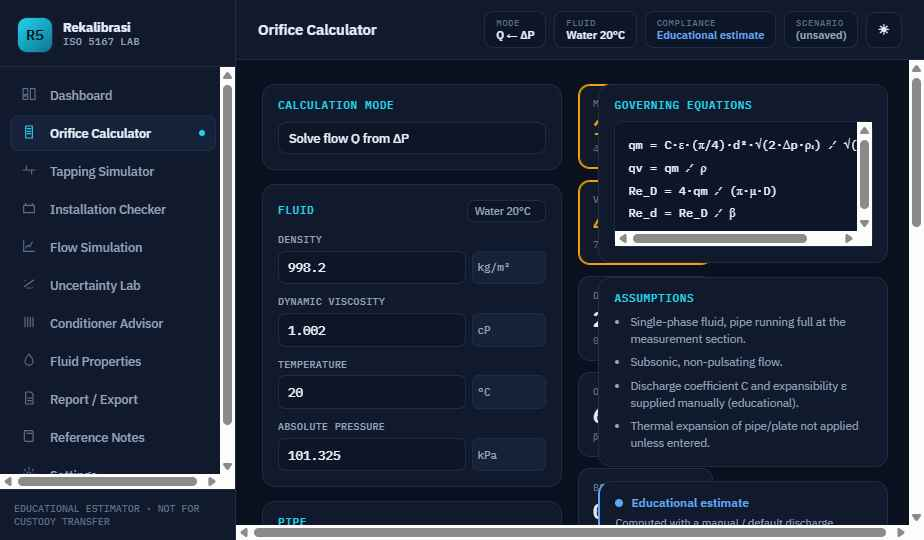

# Rekalibrasi ISO 5167 Lab

**Interactive Differential-Pressure Flow-Measurement & Orifice-Plate Simulator** — a
static, offline-capable web app for *learning and pre-sizing* orifice-plate flow
measurement based on ISO 5167 concepts.

> ⚠️ **Educational estimator — not for custody transfer.** This application is for
> engineering learning, preliminary calculation and sanity-checking only. It does not
> replace the official ISO 5167 standard, certified flow-computer software, vendor
> sizing software, laboratory calibration, or review by a qualified engineer.

<p align="center">
  
</p>

---

## What it does

A single-page instrumentation "front panel" with eleven modules:

| Module | Purpose |
| --- | --- |
| **Dashboard** | Live cockpit with digital readouts (mass/volume flow, Reₚ, β). |
| **Orifice Calculator** | Six solve modes — forward (Q from ΔP) and reverse (size ΔP, bore *d*, or β for a target flow). |
| **Tapping & Flow Sim** | Corner / flange / D–D/2 tap layout with a live vena-contracta flow animation. |
| **Installation Checker** | Scores straight-run, fittings, swirl and flow-conditioner need. |
| **Conditioner Advisor** | Flow-conditioner comparison and pressure-loss estimate. |
| **Sensitivity Charts** | ΔP–Q, β, density and Reynolds sensitivity plots. |
| **Uncertainty Lab** | Root-sum-square combined uncertainty with per-source contribution. |
| **Fluids & Steam Tables** | Nominal fluid database + saturated-steam table, one-click into the calculator. |
| **Report / Export** | JSON, CSV and printable report. |
| **Reference Notes** | Plain-language concepts, governing formulas and a glossary. |
| **Settings** | Theme + local scenario management. |

### Educational / training features

- **🎓 Guided tour** — an onboarding walkthrough (top-right button) that explains each module and can jump you straight to it.
- **Worked examples** — four one-click teaching scenarios on the calculator (water, auto-coefficient, compressible gas, bore sizing).
- **ISO 5167-2 auto coefficient** — switch the discharge coefficient *C* from **Manual** to **ISO 5167-2 (auto)** and it is computed from β, Reₚ and tapping via the **Reader–Harris/Gallagher (2000)** equation, iterated with the Reynolds number. Gas **expansibility ε** uses the ISO 5167-2 expansibility equation.
- **Show working** — a step-by-step panel that substitutes your numbers into the flow equation.
- **Field tooltips** — hover the **?** next to any input for what it means and why it matters.
- **Formulas + glossary** on the Reference page.

### UI / UX

A MATLAB / LabVIEW-style **instrument front panel**: an acquisition toolbar
(RUN/STOP, live status LEDs), glowing digital "screen" readouts, a graph-paper grid
background, beveled panels, and both a dark "instrument rack" and a light
"brushed-silver panel" theme.

---

## Deploying to GitHub Pages

The app is **plain static HTML/JS — no build step**. React and ReactDOM are vendored
locally under `vendor/`, so it runs fully offline with **no runtime CDN dependency**.

### Option A — GitHub Actions (included, recommended)

A workflow at [`.github/workflows/deploy.yml`](.github/workflows/deploy.yml) publishes
the repository root to Pages automatically.

1. Push to `main` (or the `claude/github-pages-educational-ui-od9nn3` branch).
2. In the repo, go to **Settings → Pages → Build and deployment → Source: GitHub Actions**.
3. The workflow runs on every push and deploys. The site URL appears in the workflow summary and under **Settings → Pages**.

### Option B — Deploy from a branch (no Actions)

1. **Settings → Pages → Source: Deploy from a branch.**
2. Choose the branch and folder **`/ (root)`**, then **Save**.
3. Wait for the green check; your site is at `https://<user>.github.io/<repo>/`.

The included **`.nojekyll`** file ensures GitHub serves the files as-is (no Jekyll processing).

---

## Running locally

No build or install needed — just serve the folder over HTTP (opening `index.html`
via `file://` will not load `support.js`/`vendor/` correctly):

```bash
# Python
python3 -m http.server 8000
# or Node
npx serve .
```

Then open <http://localhost:8000/>.

---

## Physics notes & scope

- Core relation: `qm = C·ε·(π/4)·d²·√(2·ΔP·ρ₁) ⁄ √(1−β⁴)`, with `Re_D = 4·qm/(π·μ·D)`.
- Reverse modes solve by bisection; the iteration history is shown in the calculator.
- The **ISO 5167-2 (auto)** coefficient implements the published Reader–Harris/Gallagher
  equation (with corner / flange / D–D/2 tapping terms and the small-pipe correction) and
  the ISO expansibility equation. It is an **educational implementation** — always verify
  against the official standard for compliant or fiscal work.
- Applicability assumed: single-phase, subsonic, non-pulsating flow in a circular pipe
  running full. Results are labelled `EDUCATIONAL_ESTIMATE` / `VALID_WITH_WARNING` /
  `OUT_OF_RANGE` accordingly.
- No copyrighted ISO 5167 text or tables are reproduced; formulas are implemented from
  published equations in original wording.

## Project structure

```
index.html      the whole application (dc template + logic)
support.js      dc-runtime that mounts the app (React-based)
vendor/         react.production.min.js + react-dom.production.min.js (vendored, offline)
.nojekyll       tell GitHub Pages to serve files verbatim
.github/workflows/deploy.yml   Pages deployment workflow
docs/           original build prompt + screenshots
```

## Saved scenarios & privacy

Everything runs in your browser. Saved scenarios live in `localStorage`; nothing is sent
to a server. Export/import scenarios as JSON from **Settings**.
